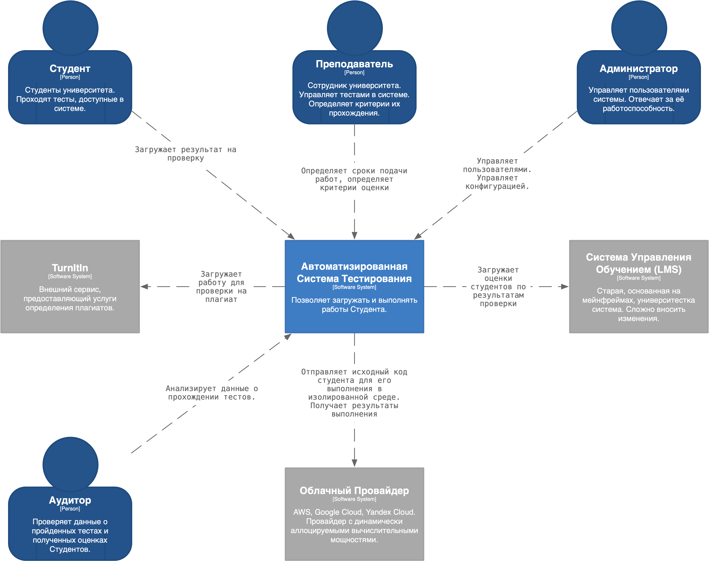
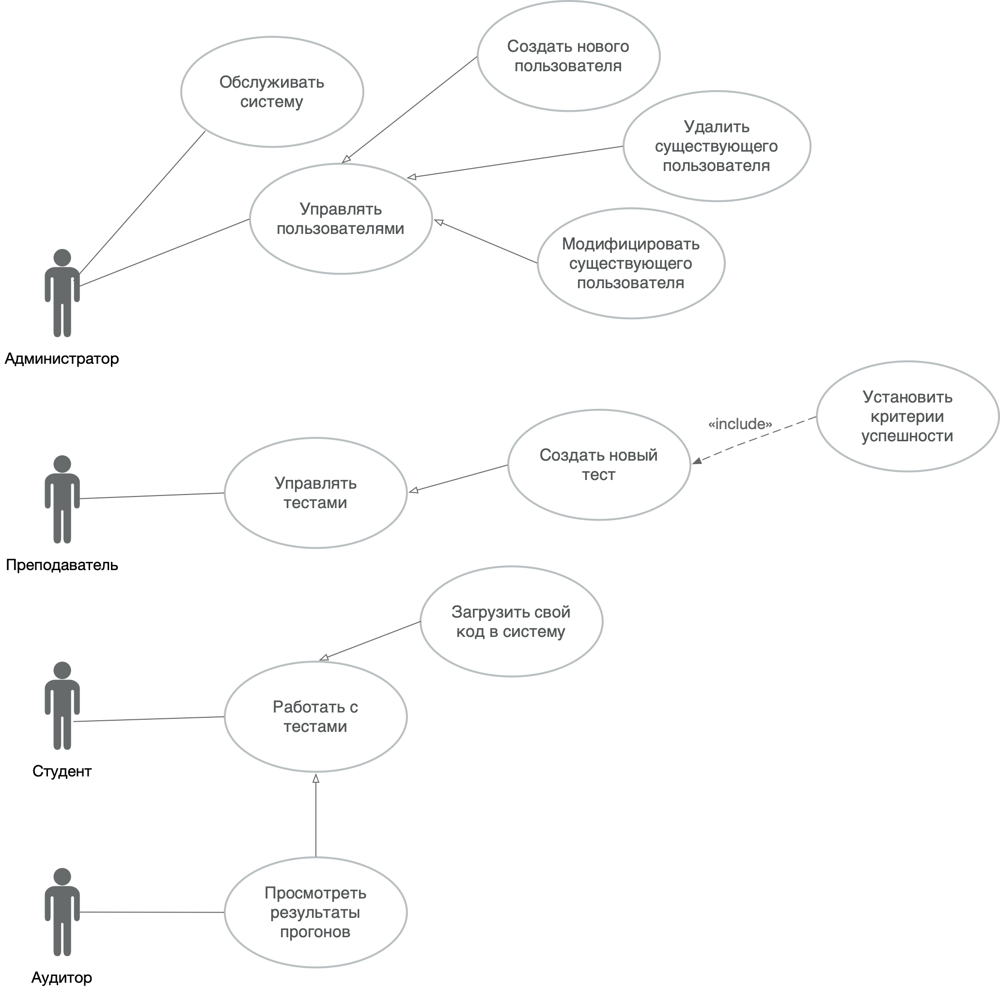

# "Check Your Work" Архитектурная Ката

## Содержание
- [Описание архитектурной ката](#описание-архитектурной-ката)
- [Анализ бизнеса](#анализ-бизнеса)
  - [Бизнес цель](#бизнес-цель)
  - [Бизнес-драйверы](#бизнес-драйверы)
  - [Стейкхолдеры](#стейкхолдеры)
  - [Открытые вопросы](#открытые-вопросы)
  - [Имеющиеся решения](#имеющиеся-решения)
- [Архитектура](#архитектура)
  - [С4: Context Diagram](#c4-диаграмма-контекста)

## Описание архитектурной ката

| Ссылка на оригинальное описание: | https://nealford.com/katas/kata?id=CheckYourWork |
| ---- | ---- |

### 🇷🇺 Описание

Университет значительно расширил свой курс CS и хочет иметь возможность автоматизировать оценку простых заданий по программированию.

* Пользователи: более 300 студентов в год, плюс персонал и администратор.

* Требования:
  * учащиеся должны иметь возможность загружать свой исходный код, который будет запущен, и выставлять оценки
  * оценки и прогоны должны быть сохраняемыми и поддаваться аудиту
  * требуется система обнаружения плагиата, включающая сравнение с другими материалами, а также отправка в веб-сервис (TurnItIn).
  * требуется интеграция с университетской системой управления обучением (LMS, Learning Management System)
  * профессор устанавливает дату и время, после которых заявки отклоняются
  * студенты могут подавать столько попыток, сколько захотят, чтобы улучшить свои оценки
  * профессора определяют критерии оценки, которые могут включать показатели и/или тесты

* Дополнительный контекст:
  * университетская система LMS основана на мэйнфреймах, и довольно сложно вносить изменения в оценки, которые ежегодно проверяются государственным регулирующим органом
  * бюджет университета на это очень мал, поскольку он строит запасной стадион для спортивного футбола
  * университет имеет рекорд по количеству выпускников CS с самыми высокими показателями в стране

## Анализ бизнеса

### Бизнес цель

Получить систему автоматизированной проверки знаний студентов по программированию. Сделать её частью процесса обучения в университете.

### Бизнес-драйверы

| Код  | Описание                                                                   |
|------|----------------------------------------------------------------------------|
| БД-1 | Оценки и результаты прогона должны быть сохранены и доступны для аудита    |
| БД-2 | Пользователь должен иметь возможность загрузить и выполнить программный код |
| БД-3 | Требуется обнаружение плагиата                                             |
| БД-4 | Профессор устанавливает крайние дату и время прохождения конкретного теста + определяет критерии оценки |
| БД-5 | Небольшой бюджет |
| БД-6 | Интеграция с университетской системой управления обучением (LMS) |

### Стейкхолдеры

| Название | Описание | Потребность                                                   |
| -------- | -------- |---------------------------------------------------------------|
| Администратор | Пользователь системы, который управляет списком пользователей, их ролями и правами. А также, отвечает за конфигурацию Системы. | Безопасность, Доступность, Надёжность, Наблюдаемость Системы. |
| Преподаватель | Пользователь системы, он же преподаватель курса Computer Science (CS). Ведёт обучение в группах студентов. Создаёт тесты в Системе. Определяет критерии успеха прохождения теста, а также сроки его прохождения. | Доступность, Надёжность Системы.                              |              |
| Студент | Пользователь системы, он же обучаемый курса Computer Science (CS). Проходит обучение будучи зачисленным в группу. Может неоднократно проходить тесты. Имеет доступ на время обучения в университете. | Доступность, Производительность Системы.                      |
| Аудитор | Пользователь системы, имеет read-only доступ к сохранённым данным об оценках и прогонах тестов. | Безопасность, Доступность Системы.                            |

### Открытые вопросы

Данная секция содержит список открытых вопросы, ответы на которые затруднительно найти в тексте описания архитектурной ката. Однако, 
эти вопросы стоило бы прояснить в личных беседах со стейкхолдерами.

* Как долго мы должны хранить историю прогона тестов и оценок для аудита? Нужно ли очищать собранные данные студентов, окончивших обучение и выпустившихся из университета?
* Требуется ли поддержка аудита для самих тестов и их настроек?
* Так ли необходима Система Обнаружения Плагиата? Возможно, это лишняя работа и лишняя трата бюджета. Дело в том, что код на любом языке программирования имеет определённую структуру и, вероятно, при его анализе совпадений будет гораздо больше, чем при анализе простого текста.
* Какими возможностями обладает Система Управления Обучением (LMS)? Какие возможности интеграции с ней она предоставляет?
* Какой конкретно бюджет заложен на разработку? А на поддержку после ввода в эксплуатацию?
* В каком виде и в каком разрезе данные требуются Аудитору?
* Решения задач на каких языках программирования Система должна поддерживать? А будет ли список расширяться в будущем? 

### Имеющиеся решения

На рынке существуют несколько решений от разных вендоров, которые решают задачу автоматизированной проверки выполнения задач по программированию на разных языках.
Ещё до начала обсуждения архитектуры собственного продукта, стоит ознакомиться со списком продуктовых альтернатив и их функционалом.

Продуктовые альтернативы:
* TopCoder (https://www.topcoder.com)
* LeetCode (https://leetcode.com)
* Qualified (https://www.qualified.io)
* CodeWars (https://www.codewars.com)
* HackerRank (https://www.hackerrank.com)

## Архитектура

### C4: Диаграмма Контекста

**Диаграмма Контекста** показывает high-level информацию о том, кто использует проектируемую систему; как она вписывается в существующий ландшафт.

### UML: Диаграмма use case'ов

**Диаграмма Сценариев Использования** показывает действия, которые пользователи системы могут с ней совершать.

