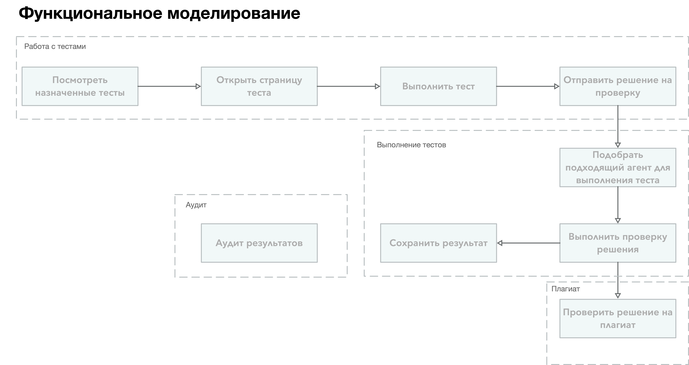
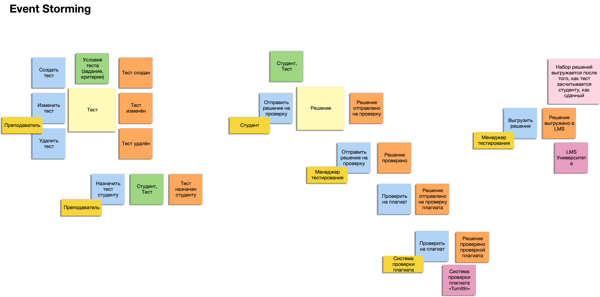
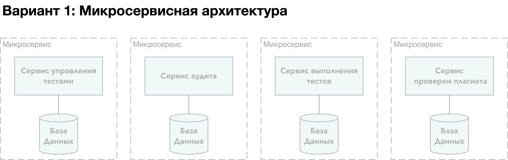
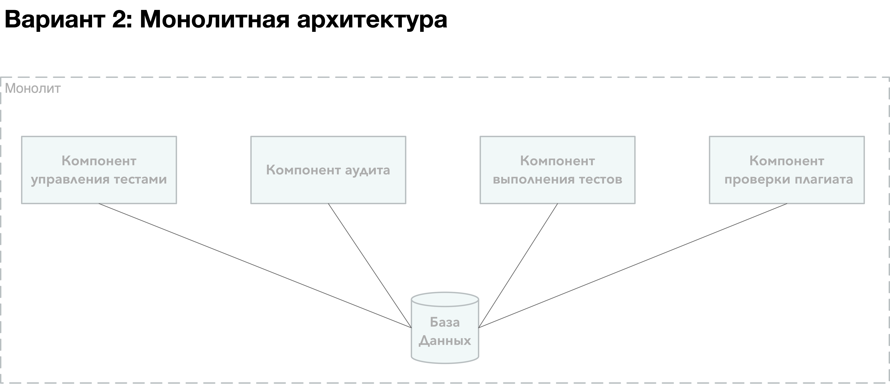

# Домашнее задание #2

## Содержание
- [Декомпозиция](#декомпозиция)
  - [Функциональная декомпозиция](#функциональная-декомпозиция)
  - [Event Storming](#event-storming)
- [Оценка модифицируемости](#оценка-модифицируемости)
  - [Альтернатива #1](#альтернатива-1)
  - [Альтернатива #2](#альтернатива-2)

## Декомпозиция

### Функциональная декомпозиция

### Event Storming

## Оценка модифицируемости

### Альтернатива #1 (A1)

### Альтернатива #2 (A2)

### Сценарии изменений и оценка

| Описание                                                             | Вероятность | Стоимость (A1)                                                                                     | Стоимость (A2)                                                                                               |
|----------------------------------------------------------------------|-------------|----------------------------------------------------------------------------------------------------|--------------------------------------------------------------------------------------------------------------|
| Добавление новых полей в аудиторские даные                           | Высокая     | C(сервис управления тестами) + С(сервис аудита) + С(сервис выполнения тестов) + С(сервис плагиата) | С(компонент управления тестами) + С(компонент аудита) + С(компонент выполнения тестов) + С(компонент аудита) |
| Добавление новых языков программирования для прогона тестов          | Высокая     | С(сервис управления тестами) + С(сервис выполнения тестов)                                         | С(компонент управление тестами) + С(компонент выполнения тестов)                                             |
| Увеличение кол-ва пользователей (студентов университета на курсе CS) | Средняя     | С(сервис выполнения тестов)                                                                        | С(настройки монолита) + С(настройки компонента выполнения тестов)                                            |
| Изменение контракта LMS                                              | Низкая      | С(сервис аудита)                                                                                   | С(компонент аудита)                                                                                          |
| Изменение контракта внешней системы проверки плагиата                | Низкая      | С(сервис плагиата)                                                                                 | С(компонент плагиата)                                                                                        |

### Вывод

Архитектурный шаблон, описанный в [ADR#001](https://github.com/anverbogatov/kata-architecture-check-your-work/blob/main/adr/0001-base-architecture-pattern.md),
в результате стоимостной и вероятностной оценки выглядит более подходящим по нескольким причинам:
* изменения в компонентах монолита дешевле изменений в сервисах микросервисной архитектуры. Монолит представляет из себя набор статически связанных компонентов, согласованных между собой в процессе сборки программы. В случае же, микросервисной архитеткруы, помимо внесения изменений в различные сервисы, требуется согласовавнный процесс выпуска этих изменений.
* учитывая характер изменений и вероятность их внесения, особых преимуществ в сопровождении нескольких архитектурных квантов (микросервисы) нет
* монолитная архитектура обладает существенно меньшей гибкостью в плане масштабирования отдельных элементов архитектуры. При условии значительного (многократного) изменения кол-ва пользователей системы это может стать узким местом. Однако, при изначальном кол-ве пользователей (300 студентов в год), этот недостаток не выглядит сколько-нибудь значимым. 
