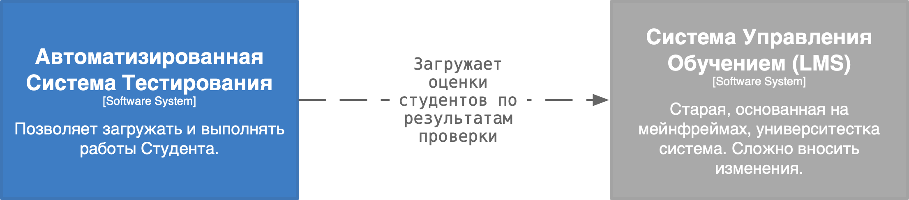
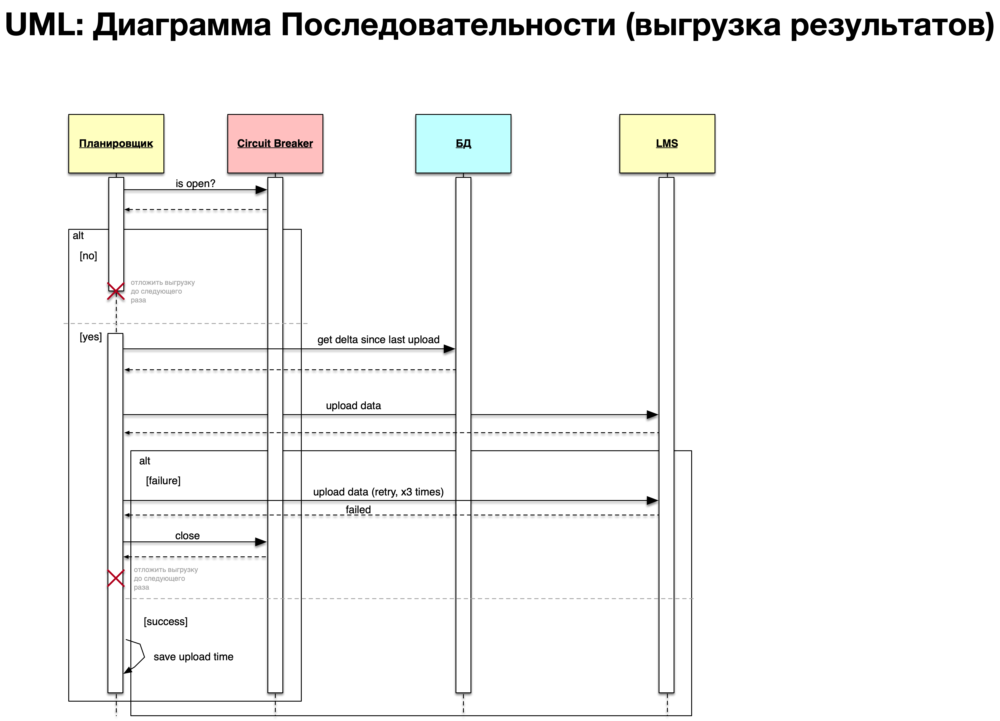

# Домашнее задание #3

## Содержание
- [Рассматриваемый кейс](#рассматриваемый-кейс)
  - [Критический сценарий](#сценарий)
  - [Алгоритм выгрузки данных в LMS](#алгоритм-выгрузки-оценок-в-lms)
- [Оценка атрибутов качества](#оценка-атрибутов-качества-)
- [Выводы](#вывод)

## Рассматриваемый кейс

Проектируемая система, согласно задаче, должна быть сынтегрирована с нескольими системами с разными
контрактами, SLO и т.д. Каждая интеграция, в таком случае, должна быть рассмотрена отдельно, все оценки должны быть
даны для каждой интеграции отдельно.

Поэтому, для простоты отработки домашнего задания, далее, будет рассмотрена одна конкретная интеграция. 
Согласно БД-6 ("Интеграция с университетской системой управления обучением (LMS)"), проектируемая система должна быть 
сынтегрирована с имеющейся Системой Управления Обучением (LMS). 

Система Управления Обучением (LMS) - согласно изначальной задаче - старая, трудномодифицируемая, основана на мейнфреймах.
Вероятно:
* нет SLO, а значит мы не можем расчитывать на доступность системы, или время обработки ею запросов
* мейнфреймы - значит система установлена на bare metal и управляется / обслуживается, скорее всего, вручную. Отсутствует современная deployment стратегия,
а это значит - во время обновления LMS, система не доступна какое-то время.
* Оценки в LMS выгружаются ДО проведения аудита оценок студентов. То есть:
  * данные могут быть выгружены в LMS не после успешного прохождения каждого теста, студентом, а централизованно. Главное ДО проведения аудита
  * данные по студенту могут быть выгружены в LMS только после получения студентом финальной оценки (нет смысла логгировать в LMS каждую неудачную попытку пройти тест)

### Сценарий:

Предыстория:
* начинается очерденой семестр Computer Science (CS)
* Преподаватель приготовил и распределил тесты на семестр по студентам

1. Студент, используя собственные реквизиты, входит в систему Автоматизированную Систему Тестирования
2. Выбирает, назначенный ему Преподавательем тест, и начинает прохождение
3. Пишет решение, отправляет на проверку
   4. Если решение верно - перейти на следующий шаг
   5. Если решение неверно - вернуться на экран теста и предложить выполнить тест ещё раз
6. Система отображает экран результата; сохраняет информацию о качестве выполнения теста и оценке за тест во внутреннюю БД
7. По времени, срабатывает асинхронный механизм, который проверяет информацию о результатов студента, и выгружает в LMS дельту за последний промежуток выгрузки

### Алгоритм выгрузки оценок в LMS

Сделать оценку атрибутов качества (например, надежность, производительность,
модифицируемость и т.д) с помощью конкретных сценариев и характеристик И
Т системы.

| Атрибут Качества   | Оценка  | Описание                                                                                                                                                                                                                                                                                                                                                                                                                                                                                                                                                                                      |
|--------------------|---------|-----------------------------------------------------------------------------------------------------------------------------------------------------------------------------------------------------------------------------------------------------------------------------------------------------------------------------------------------------------------------------------------------------------------------------------------------------------------------------------------------------------------------------------------------------------------------------------------------|
| Надёжность         | Высокая | Система спроектирована устойчивой. В случае недоступности LMS, подготовленные для выгрузки данные не теряются. Они будут выгружены в следующий раз. Также система застрахована от лёгких "заиканий" в рамках коммуникаций из-за кратковременной недоступности LMS или сетевых проблем за счёт использования Retry'я. Circuit Breaker так же позволяет снять нагрузку с LMS, в случае его отказа за счёт временного прекращения посыла сообщений.                                                                                                                                              |
| Производительность | Низкая  | Сам по себе процесс выгрузки данных в LMS - асинхронный. Предполагается его запуск по расписанию ежесуточно. Поэтому особых требований к производительности операции тут нет и быть не может, потому что LMS не имеет SLO, а значит никаких гарантий как поведёт себя система, насколько быстро ответит.                                                                                                                                                                                                                                                                                      |
| Модифицируемость   | Высокая | Предлагаю рассмотреть два сценария модификации процесса выгрузки: 1) замена асинхронной выгрузки на синхронную 2) изменение контракта / используемого протокола со стороны LMS. В первом случае - код для синхронной выгрузки уже реализован и используется Планировщиком. Достаточно начать использовать его в другом месте, в ответ на какую либо операцию в пользовательском интерфейсе. Во втором случае - в зависимости от изменения (протокол, структура данных и т.д.) изменение будет не сильно трудоёмким, так как компонент и логика интеграции с LMS будут выделены в кодовй базе. |
| Удобство поддержки | Среднее | В отличие от синхронной обработки команд пользователей, когда мы сразу же видим результат (и можем судить о том, как себя повела система), в случае с внутренними асинхронными механизмами - крайне легко пропустить момент, когда система перестала выполнять свои функции. Поэтому требуется озаботиться вопросами мониторинга и алёртинга до ввода в эксплуатацию.                                                                                                                                                                                                                         |
| Отказоустойчивость | Высокая | Выгрузка данных в LMS - асинхронный механизм. Содержит Retry'ер для повторных попыток выгрузки, если потребуется.                                                                                                                                                                                                                                                                                                                                                                                                                                                                             |
| Безопасность | Высокая | Выгрузка данных в LMS не работает с данными, переданными пользователями. Работает только с данными, созданными и обработанными внутри самой системы. У Студентов нет возможности повлиять на работу выгрузки.

### Вывод

Простейшие механизмы fail-over'а для интеграций, такие как Retryer и Circuit Breaker 
позволяют справится с простыми проблемами интеграций и при этом не перегрузить систему.
Однако, для более сложных сценариев, когда Retry'еры и Circuit Breaker'ы не справились, следует
предусмотреть дополнительные механизмы (например, на уровне логики работы сервиса).